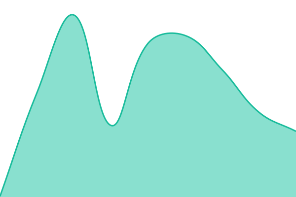
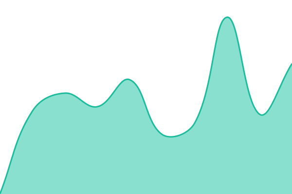

# [📈 Live Status](https://demo.upptime.js.org): <!--live status--> **🟩 All systems operational**

This repository contains the open-source uptime monitor and status page for [Upptime](https://upptime.js.org), powered by [Upptime](https://github.com/upptime/upptime).

With [Upptime](https://upptime.js.org), you can get your own unlimited and free uptime monitor and status page, powered entirely by a GitHub repository. We use [Issues](https://github.com/upptime/upptime/issues) as incident reports, [Actions](https://github.com/upptime/upptime/actions) as uptime monitors, and [Pages](https://demo.upptime.js.org) for the status page.

<!--start: status pages-->
<!-- This summary is generated by Upptime (https://github.com/upptime/upptime) -->
<!-- Do not edit this manually, your changes will be overwritten -->
<!-- prettier-ignore -->
| URL | Status | History | Response Time | Uptime |
| --- | ------ | ------- | ------------- | ------ |
|  [Nanoo Labs](https://nanoolabs.dev) | 🟩 Up | [nanoo-labs.yml](https://github.com/nanoolabs/status/commits/HEAD/history/nanoo-labs.yml) | 

 177ms
     
 | 

<a href="https://status.nanoolabs.dev/history/nanoo-labs">100.00%</a>
    

|  [Nanoo Root](https://root.nanoolabs.dev) | 🟩 Up | [nanoo-root.yml](https://github.com/nanoolabs/status/commits/HEAD/history/nanoo-root.yml) | 

 479ms
     
 | 

<a href="https://status.nanoolabs.dev/history/nanoo-root">100.00%</a>
    

|  [Nanoo Webrings](https://webrings.nanoolabs.dev) | 🟩 Up | [nanoo-webrings.yml](https://github.com/nanoolabs/status/commits/HEAD/history/nanoo-webrings.yml) | 

 1029ms
     
 | 

<a href="https://status.nanoolabs.dev/history/nanoo-webrings">100.00%</a>
    

|  [Nanoo Stack](https://stack.nanoolabs.dev) | 🟩 Up | [nanoo-stack.yml](https://github.com/nanoolabs/status/commits/HEAD/history/nanoo-stack.yml) | 

 200ms
     
 | 

<a href="https://status.nanoolabs.dev/history/nanoo-stack">100.00%</a>
    

|  [Nanoo Docs](https://docs.nanoolabs.dev) | 🟩 Up | [nanoo-docs.yml](https://github.com/nanoolabs/status/commits/HEAD/history/nanoo-docs.yml) | 

 153ms
     
 | 

<a href="https://status.nanoolabs.dev/history/nanoo-docs">100.00%</a>
    

|  [Nanoo CDN](https://cdn.nanoolabs.dev) | 🟩 Up | [nanoo-cdn.yml](https://github.com/nanoolabs/status/commits/HEAD/history/nanoo-cdn.yml) | 

 127ms
     
 | 

<a href="https://status.nanoolabs.dev/history/nanoo-cdn">100.00%</a>
    

<!--end: status pages-->

[**Visit our status website →**](https://demo.upptime.js.org)

## 📄 License

- Powered by: [Upptime](https://github.com/upptime/upptime)
- Code: [MIT](./LICENSE) © [Anand Chowdhary](https://anandchowdhary.com)
- Data in the `./history` directory: [Open Database License](https://opendatacommons.org/licenses/odbl/1-0/)
